# XRPL Indexer

> A self-hosted XRP Ledger indexer, REST API, background enricher, and dashboard — one TypeScript monorepo, one Postgres database, no external services required.


The indexer subscribes to `rippled`/Clio, folds every ledger into a normalised
Postgres schema, and exposes it as a documented REST API and a Next.js dashboard.
Background workers enrich tokens and NFTs with off-chain metadata. Everything runs
on a single VPS; enrichment can fan out to more machines when you want it to.

**No media is ever stored** — enrichment keeps the canonical `ipfs://` / `ar://` /
`https://` link and nothing else. **API keys never reach the browser** — the
dashboard talks to the API only from the server.

---

## Contents

- [What you get](#what-you-get)
- [Architecture](#architecture)
- [Prerequisites](#prerequisites)
- [Quick start (local)](#quick-start-local)
- [Configuration](#configuration)
- [The REST API](#the-rest-api)
- [Running in production](#running-in-production)
- [Data & storage sizing](#data--storage-sizing)
- [XRPL endpoints — live vs backfill](#xrpl-endpoints--live-vs-backfill)
- [Initial state snapshot](#initial-state-snapshot)
- [Historical ledger backfill](#historical-ledger-backfill)
- [Scaling enrichment across machines](#scaling-enrichment-across-machines)
- [Deploying the dashboard on Vercel](#deploying-the-dashboard-on-vercel)
- [Project layout](#project-layout)
- [Development](#development)
- [Design notes](#design-notes)
- [Troubleshooting](#troubleshooting)
- [License](#license)

---

## What you get

**Indexer** (`apps/indexer`)
- Live `ledger` subscription with automatic catch-up from a persisted checkpoint.
- One-time full-state snapshot so dormant trustlines / NFTs / pools are captured,
  not just deltas from the moment you started.
- Optional resumable **historical backfill** that walks the chain backward to any
  ledger (down to genesis).
- Normalised schema: accounts, ledgers, IOU/MPT tokens, trustlines & balances,
  NFTs / offers / exchanges, DEX fills, AMMs, vaults, price oracles, and sparse
  per-ledger metric series (holders / supply / trustlines / marketcap).

**REST API** (`apps/api`) — Fastify
- API-key auth with per-key **scopes** and per-key rate limits.
- Interactive OpenAPI docs at **`/docs`**; `/healthz` for load balancers.
- Tokens, MPTs, NFTs, collections, issuers, holders, metric time-series, AMMs,
  vaults, oracles, account holdings, and aggregate stats.
- In-process response cache; safe to put straight behind a CDN.

**Enrichment** (`apps/backfiller` + `apps/worker`) — [pg-boss](https://github.com/timgit/pg-boss) (Postgres-backed, no Redis)
- Bulk token/issuer metadata from xrplmeta; per-token fallback via xrpl.to.
- NFT collections via Bithomp issuer catalogs (includes already-burned NFTs);
  per-NFT fallback fetches the metadata JSON from IPFS/Arweave gateways.
- Periodic rollups into `token_stats` / `nft_collection_stats` and a
  `dashboard_snapshot` history for the trend charts.
- Fully decoupled from the indexer/API — scale it onto other boxes at will.

**Dashboard** (`apps/dashboard`) — Next.js 15, deploys to Vercel
- Overview with live counts, metadata-coverage bars, and a timeframe-selectable
  trend chart.
- Sortable / searchable / filterable **Tokens** and **Collections** explorers.
- Token, NFT, collection, and **issuer** detail pages (traits, offers, sale
  history, click-to-copy addresses).
- NFT media previews via a same-origin stream proxy (public gateways block
  hotlinking) — still nothing persisted.
- Operator-gated **Admin** (API keys) and **Backfill** status pages.

---

## Architecture

```mermaid
flowchart LR
  subgraph XRPL["XRP Ledger nodes"]
    N1["rippled / Clio<br/>(recent window)"]
    N2["rippled / Clio<br/>(full history)"]
  end

  N1 -- "live ledger stream" --> IDX["apps/indexer"]
  N2 -- "snapshot + history" --> IDX
  IDX -- "write" --> PG[("PostgreSQL<br/>schema + pg-boss queue")]

  PG --> API["apps/api<br/>Fastify REST + /docs"]
  PG <-->|jobs| BF["apps/backfiller<br/>schedules + discovery"]
  PG <-->|jobs| WK["apps/worker<br/>metadata enrichment"]
  WK -- "fetch JSON only" --> EXT["IPFS / Arweave<br/>Bithomp / xrplmeta / xrpl.to"]

  API --> DASH["apps/dashboard<br/>Next.js (Vercel)"]
  USER(["Browser"]) --> DASH
```



Everything except the dashboard is designed to co-locate on one host. Postgres is
the only stateful component — pg-boss uses it as the job queue, so there is no
Redis or message broker.

| App | What it does |
| --- | --- |
| `apps/indexer` | ledger → Postgres ingestion (live sync, snapshot, `--mode=backfill`) |
| `apps/api` | Fastify REST API + Swagger UI at `/docs` |
| `apps/backfiller` | pg-boss cron schedules + work-discovery scans (**one instance only**) |
| `apps/worker` | pg-boss job handlers; `WORKER_QUEUES` selects what each instance runs |
| `apps/dashboard` | Next.js dashboard — talks to the API server-side only |

| Package | What it provides |
| --- | --- |
| `packages/core` | zod config loader, pino logger, shared errors + domain types |
| `packages/codec` | XRPL codecs — address, currency, NFT `tokenId`, MPT issuance id, XLS-24/89 |
| `packages/db` | Drizzle schema + migrations + typed client + API-key / bootstrap helpers |
| `packages/xrpl-client` | rippled/Clio connection pool + ledger subscription / fetch |
| `packages/sources` | SSRF-hardened fetch, IPFS/Arweave resolver, metadata normaliser, providers |
| `packages/jobs` | pg-boss wrapper — queue names, typed payloads, helpers |
| `packages/enrich` | shared enrichment handlers, `runRollup`, `runDiscovery` (worker + backfiller) |

---

## Prerequisites

| Requirement | Notes |
| --- | --- |
| **Linux x86-64** | macOS works for local dev |
| **Node ≥ 20** | 24 tested |
| **pnpm 10 / 11** | `corepack enable` (repo pins the version) |
| **Docker + Compose** | for Postgres 16 + pgweb; or bring your own Postgres 16 |
| **Outbound HTTPS / WSS** | to XRPL nodes, IPFS gateways, metadata providers |

No native build toolchain, no Redis, no object storage. TypeScript runs directly
via `tsx` / Next — there is no build step for the services.

---

## Quick start (local)

```bash
git clone <your-fork-url> xrpl-indexer && cd xrpl-indexer
corepack enable
pnpm install
cp .env.example .env            # then edit — see Configuration below

# 1. infrastructure — Postgres + pgweb only
docker compose up -d            # Postgres :5432, pgweb :8081
pnpm db:migrate                 # apply packages/db/drizzle/*.sql

# 2. mint the dashboard's admin API key + seed the first operator.
#    The key is printed ONCE — copy it into .env as XRPL_API_ADMIN_KEY
#    (and, to start, XRPL_API_KEY too). Re-running never prints it again.
ADMIN_BOOTSTRAP_USER=admin ADMIN_BOOTSTRAP_PASSWORD='choose-a-password' pnpm bootstrap

# 3. the services — plain Node processes (NOT started by docker compose).
#    Each `start` runs in the foreground — use a separate terminal per line,
#    or jump straight to PM2 (see "Running in production").
pnpm --filter @xrpl-indexer/indexer    start   # ledger → Postgres
pnpm --filter @xrpl-indexer/api        start   # REST API on :4100
pnpm --filter @xrpl-indexer/backfiller start   # schedules + discovery + rollups (one instance)
WORKER_QUEUES=nft.metadata,nft.collection,token.metadata \
  pnpm --filter @xrpl-indexer/worker   start   # enrichment
pnpm --filter @xrpl-indexer/dashboard  dev     # dashboard on :3000
```

You should now have:

| URL | What |
| --- | --- |
| `http://localhost:4100/healthz` | API liveness |
| `http://localhost:4100/docs` | interactive API reference (OpenAPI) |
| `http://localhost:3000` | dashboard |
| `http://localhost:8081` | pgweb — browse the database |

The indexer starts a full-state snapshot on first run (see
[Initial state snapshot](#initial-state-snapshot)), then live-syncs from
`INDEXER_START_LEDGER` (`current` by default). For anything beyond a local trial,
run the services under a supervisor — see
[Running in production](#running-in-production).

---

## Configuration

**[`.env.example`](.env.example) is the source of truth** — every variable is
documented inline there. Copy it to `.env` and work through it. The groups:

| Group | Key variables |
| --- | --- |
| Shared | `DATABASE_URL`, `DB_POOL_MAX`, `LOG_LEVEL` |
| Indexer | `XRPL_ENDPOINTS` and the `*_SYNC_ / *_BACKFILL_ / *_SNAPSHOT_` variants, `INDEXER_START_LEDGER`, `INDEXER_SNAPSHOT_ON_START`, `INDEXER_TRACK_XRP_BALANCES`, `INDEXER_BACKFILL_FLOOR` |
| API | `API_PORT`, `API_RESPONSE_CACHE_TTL_MS`, `API_DEFAULT_IPFS_GATEWAY` |
| Enrichment | `WORKER_QUEUES`, `WORKER_CONCURRENCY` (+ per-queue overrides), `*_CRON`, `METADATA_GATEWAYS`, `METADATA_IPFS_RPM` |
| Providers | `BITHOMP_API_KEY` (+ base URL / RPM), `XRPLTO_BASE_URL`, `XRPLMETA_BASE_URL` — all optional |
| Dashboard | `XRPL_API_BASE_URL`, `XRPL_API_KEY`, `XRPL_API_ADMIN_KEY`, `AUTH_SECRET`, `IPFS_GATEWAY`, `AR_GATEWAY`, `ADMIN_BOOTSTRAP_*` |

**Minimum to get a useful local index:** set `DATABASE_URL` (matches the compose
file out of the box), replace the `AUTH_SECRET` placeholder with a real value —
`openssl rand -base64 32` — and leave `XRPL_ENDPOINTS` on the public defaults.
Everything else has a sane default. Add `BITHOMP_API_KEY` when you want NFT
collection enrichment; point the endpoint variables at your own node before
attempting a large historical backfill.

---

## The REST API

### Authentication

Every route except `/healthz` and `/docs` requires an API key in the
**`x-api-key`** header. Keys carry **scopes** and a per-minute rate limit
(returned in `x-ratelimit-limit`). A key with the `admin` scope passes every
scope check.

| Scope | Grants |
| --- | --- |
| `stats` | `/stats`, `/stats/history` |
| `tokens` | `/tokens…`, `/mpts…`, `/issuers/:address`, `/accounts/:address/{tokens,mpts}` |
| `nfts` | `/nfts…`, `/collections…`, `/accounts/:address/nfts` |
| `amm` / `vaults` / `oracles` | `/amm`, `/vaults`, `/oracles` |
| `admin` | `/admin/*` (key management, operator login, job depths) + all of the above |

Create keys with `pnpm bootstrap` (first run) or from the dashboard's
**Admin → API Keys** page.

### Endpoints

| Method & path | Scope | Purpose |
| --- | --- | --- |
| `GET /healthz` | — | liveness |
| `GET /docs` | — | interactive OpenAPI reference |
| `GET /stats` | `stats` | aggregate counts + coverage |
| `GET /stats/history?hours=` | `stats` | downsampled `dashboard_snapshot` series |
| `GET /tokens` | `tokens` | list — `sortBy,order,limit,offset,search,issuer,type,verified` |
| `GET /tokens/:issuer/:currency` | `tokens` | IOU token detail |
| `GET /tokens/:issuer/:currency/holders` | `tokens` | paged holders |
| `GET /tokens/:issuer/:currency/series/:metric` | `tokens` | `price\|trustlines\|holders\|supply\|marketcap` time-series |
| `GET /mpts/:mptIssuanceId[/holders\|/series/:metric]` | `tokens` | MPT equivalents |
| `GET /issuers/:address` | `tokens` | issuer identity + token/collection/NFT counts |
| `GET /nfts/:tokenId` | `nfts` | NFT detail — metadata, media, open offers, recent sales |
| `GET /nfts/:tokenId/image` | `nfts` | resolved image/media gateway URLs |
| `GET /collections` | `nfts` | list — `sortBy,order,limit,offset,search,issuer,namedOnly` |
| `GET /collections/:issuer/:taxon[/nfts]` | `nfts` | collection detail / items |
| `GET /amm`, `GET /vaults`, `GET /oracles` | resp. | paged lists |
| `GET /accounts/:address/{nfts,tokens,mpts}` | `nfts`/`tokens` | holdings for an account |
| `POST /admin/login` | `admin` | operator login (key **and** password) |
| `GET/POST/PATCH /admin/keys…` | `admin` | key management |
| `GET /admin/jobs` | `admin` | pg-boss queue depths |

### Example

```bash
curl -s http://localhost:4100/tokens'?sortBy=holders&order=desc&limit=5' \
  -H "x-api-key: $XRPL_API_KEY" | jq
```

---

## Running in production

`docker compose` only manages **Postgres + pgweb**. `indexer`, `api`,
`backfiller` and `worker` are plain `tsx src/main.ts` processes — run them under a
supervisor.

### PM2 (bundled config)

```bash
pnpm add -g pm2
pm2 start ops/pm2/ecosystem.config.cjs
pm2 save && pm2 startup                      # survive reboots
pm2 status ; pm2 logs
```

`pm2 start ops/pm2/ecosystem.config.cjs` brings up **five** processes:

| PM2 name | App | Role | Count | Runs only if |
| --- | --- | --- | --- | --- |
| `xrpl-indexer` | `apps/indexer` | **live** ledger subscription + catch-up + initial snapshot | 1 | always |
| `xrpl-api` | `apps/api` | REST API on `API_PORT` | 1+ | always |
| `xrpl-backfiller` | `apps/backfiller` | **enrichment orchestrator** — owns the pg-boss cron schedules (`token.catalog`, `stats.rollup`, `discovery.scan`) and the work-discovery scans that enqueue metadata jobs. *Nothing to do with ledger history.* | **exactly 1** | always |
| `xrpl-worker` | `apps/worker` | executes the metadata jobs the backfiller enqueues (`nft.metadata`, `nft.collection`, `token.metadata`) | 1+ (scale out) | always |
| `xrpl-ledger-backfill` | `apps/indexer --mode=backfill` | **ledger history** — walks *descending* from the oldest indexed ledger down to `INDEXER_BACKFILL_FLOOR`, replaying transactions into the append-only history tables. Its own resumable process, metrics on `:9104`. | 0–1 | `INDEXER_BACKFILL_FLOOR > 0` (else it idles) |

> **`xrpl-backfiller` vs `xrpl-ledger-backfill`** — confusingly similar names, unrelated jobs.
> `xrpl-backfiller` = token/NFT **metadata** enrichment scheduling. `xrpl-ledger-backfill` =
> replaying **historical ledgers**. You want `xrpl-backfiller` running always; you want
> `xrpl-ledger-backfill` only while you're filling in chain history.

Postgres + pgweb stay in Docker (`docker compose up -d`). That's the whole
runtime: 5 PM2 processes + 2 containers.

**Redeploy after `git pull`:**

```bash
git pull
pnpm install                                # picks up dependency changes
pnpm --filter @xrpl-indexer/db migrate      # apply any new drizzle/*.sql
pm2 restart ops/pm2/ecosystem.config.cjs --update-env
```

Restart just one: `pm2 restart xrpl-api`. The indexer is safe to bounce anytime —
it resumes from `indexer_checkpoint` and auto-catches-up any gap (falling back to
`XRPL_BACKFILL_ENDPOINTS` if the gap predates your sync node's retained window).
See [Historical ledger backfill](#historical-ledger-backfill) for `xrpl-ledger-backfill`.

### systemd (alternative)

One unit per service, e.g. `/etc/systemd/system/xrpl-indexer.service`:

```ini
[Service]
WorkingDirectory=/opt/xrpl-indexer/apps/indexer
ExecStart=/opt/xrpl-indexer/node_modules/.bin/tsx src/main.ts
Restart=always
RestartSec=3
User=xrpl
Environment=NODE_ENV=production

[Install]
WantedBy=multi-user.target
```

`git pull && pnpm install && sudo systemctl restart xrpl-indexer xrpl-api …`

### Observability

- **`GET /healthz`** on the API (`API_PORT`) — liveness for a load balancer.
- **Indexer**: a small HTTP server on `INDEXER_METRICS_PORT` (9101; the backfill
  process uses 9104) serving `/healthz` **and `/metrics`** — Prometheus with
  `prom-client` defaults plus ledger lag, ledgers processed, and process errors.
- **Backfiller / worker**: a plain `{"status":"ok"}` health endpoint on
  `BACKFILLER_METRICS_PORT` (9102) / `WORKER_METRICS_PORT` (9103).
- The dashboard's **Backfill** page and `GET /admin/jobs` show live pg-boss queue
  depths.

### Docker (services)

The repo ships no service image yet. A single root `Dockerfile` selecting the app
via `APP=indexer|api|backfiller|worker` is straightforward to add if you want to
run the services in containers too.

---

## Data & storage sizing

`indexer`, `api`, `backfiller`, `worker` and Postgres are designed to co-locate on
one host (the dashboard goes on Vercel). **Postgres is the sizing driver**; the
Node services are light and mostly network-bound.

| Tier | vCPU | RAM | Disk (NVMe SSD) | XRPL source | What you get |
| --- | --- | --- | --- | --- | --- |
| **Minimum** | 4 | 8 GB | 100 GB | public endpoints (`wss://xrplcluster.com`, …) | live-forward indexing from "now", API + dashboard, a few metadata workers. DB grows a few GB/month. |
| **Recommended** | 8 | 24–32 GB | 200 GB – 1 TB | public endpoints, or your own Clio | comfortable live sync + several M ledgers of history (XRP tracking off), 4–8 workers, tuned Postgres. |
| **Full history** | 16 | 64 GB+ | 2–4 TB, expandable | **your own Clio node or a paid full-history provider** — public endpoints will rate-limit/ban a genesis backfill | genesis backfill and/or `INDEXER_TRACK_XRP_BALANCES=true`. Use TimescaleDB + compression. |

### What actually consumes disk

Roughly in size order:

1. **`account_balance`** — append-only per-ledger balance-change log (IOU
   trustlines + MPT holdings + AMM/Vault reserves). The largest table. **Native
   XRP balances are not recorded per-account by default** —
   `INDEXER_TRACK_XRP_BALANCES=false` skips ~50 rows/ledger (~1 M/day) of pure
   fee-payer churn. Turn it on only for an XRP rich list / per-account XRP
   history; pool pseudo-accounts are tracked either way.
2. **`token_exchange`** — one row per DEX fill; needed for price series.
3. **`nft`** — one row per NFT (64-char hex PK + 3 indexes).
4. **`nft_meta`** — enrichment cache: name/description/URIs/`attributes` jsonb.
5. **`token_supply` / `_holders` / `_trustlines` / `_marketcap`** — sparse
   "value changed at ledger N" points; small.
6. `account`, `ledger`, `nft_offer`, `nft_exchange`, `amm`, `vault`, `oracle` —
   all minor.

Postgres runs ~1.5–2.5× the on-disk size of an equivalent SQLite. For a window
like "~7 M ledgers of history + full current NFT/token state + metadata" expect
**~120–180 GB** with XRP tracking off. A full genesis backfill *with* XRP tracking
is where multi-TB comes from — use the **TimescaleDB** image, turn on columnar
compression for `account_balance` and `token_exchange`, and range-partition
`account_balance` by ledger.

### Per-process footprint (steady state, once caught up)

| Process | vCPU | RAM | Notes |
| --- | --- | --- | --- |
| Postgres 16 | 2–8 | most of the box | give it the RAM and the fast disk |
| `apps/indexer` | ~1 | 256–512 MB | ~1 s/ledger — keeps up with 3–4 s closes with headroom |
| `apps/api` | 0.5–2 | 256–512 MB | scales with request volume; in-process cache + rate limiter |
| `apps/backfiller` | ~0.25 | 128–256 MB | singleton — schedules + discovery + `token.catalog` + `stats.rollup` |
| `apps/worker` | ~0.25 each | ~256 MB each | fan-out queues; **provider rate limits are the real cap**, not CPU |
| `xrpl-ledger-backfill` | ~0.5 | 256–512 MB | optional; only when `INDEXER_BACKFILL_FLOOR > 0` |

---

## XRPL endpoints — live vs backfill

The indexer takes **separate endpoint lists** so live sync and history can use
different nodes:

| Env var | Used by | Needs full history? |
| --- | --- | --- |
| `XRPL_SYNC_ENDPOINTS` | live `ledger` subscription + catch-up | no — a recent-window node (your own Clio) is ideal |
| `XRPL_BACKFILL_ENDPOINTS` | `--mode=backfill` history fill + live-sync pruned-gap fallback | **yes** — your own full-history node, or a public cluster |
| `XRPL_SNAPSHOT_ENDPOINTS` | initial `ledger_data` state walk | admin access matters — see below |
| `XRPL_ENDPOINTS` | fallback for any of the above left unset | — |

Typical setup: `XRPL_SYNC_ENDPOINTS` → your Clio, `XRPL_BACKFILL_ENDPOINTS` → a
public full-history cluster. The live syncer also automatically falls back to the
backfill endpoints if it needs a ledger the sync node has already pruned, so a
non-full-history Clio is safe for day-to-day sync.

---

## Initial state snapshot

Live sync only captures `AffectedNodes` deltas from the moment it starts, so a
dormant trustline / NFT / pool that's never touched again would stay invisible.
On first start, `INDEXER_SNAPSHOT_ON_START=true` runs a one-time `ledger_data`
walk of full ledger state through the same handlers, then hands off to live sync.

- **Self-detecting** — tracked in `snapshot_state`; if it has never reached
  `done`, it runs. Existing databases just need `pnpm db:migrate` + a restart.
- **Snapshots at the checkpoint ledger** when one exists, so it fills dormant
  objects *as of where delta-sync already is* — `INSERT … DO NOTHING` never
  regresses state you already have. Fresh DB → snapshots at current, seeds the
  checkpoint.
- **Resumable** — kill it (restart, crash) and it continues from the persisted
  pass + marker.
- **Speed depends on admin access.** `ledger_data` for a non-admin connection is
  capped at **256 objects/page** (rippled and Clio) — a full snapshot is then
  several hours. An **admin** connection lifts that to 2048/page (~10× faster):
  run `--mode=snapshot` on the node's own box (`ws://127.0.0.1:<port>` is admin),
  or whitelist the indexer's IP in Clio's `dos_guard.whitelist`, or point
  `XRPL_SNAPSHOT_ENDPOINTS` at rippled's admin WS port (`ws://<lan-ip>:6006`).
- Run it standalone:
  `pnpm --filter @xrpl-indexer/indexer start -- --mode=snapshot`.

---

## Historical ledger backfill

The snapshot fixes *current* state; backfill extends the indexed range
*backward*. The `xrpl-ledger-backfill` PM2 process (or `--mode=backfill`) walks
**descending** from `min(ledger.sequence) - 1` down to `INDEXER_BACKFILL_FLOOR`,
replaying each ledger's transactions into the append-only history tables
(`token_exchange`, `nft_exchange`, NFT mints/burns, offers, historical
`account_balance` rows).

- **Off unless `INDEXER_BACKFILL_FLOOR > 0`.** Set it to an explicit ledger index
  — `32570` for full history, or higher for a window. The dedicated process also
  needs `INDEXER_BACKFILL_ENABLED=true` (the bundled PM2 app sets this; don't set
  it on the live `xrpl-indexer`).
- **Resumable** — progress is one `ledger_gap` row whose `range_end` is walked
  downward as a cursor; a crash + restart resumes from it. At the floor the row
  is marked `done` and the process idles.
- **Append-only** — backfilled ledgers do **not** write per-ledger
  holder/supply/trustline metric points (walking history backward can't
  reconstruct point-in-time values). It never touches `indexer_checkpoint`.
- **Endpoints:** `XRPL_BACKFILL_ENDPOINTS`. Against public clusters keep
  `INDEXER_BACKFILL_CONCURRENCY` at 4–6 (they rate-limit); your own node goes
  faster.
- **Historically burned NFTs** (minted *and* burned before the floor) are covered
  separately by the Bithomp issuer-catalog path (`nft.collection`), which streams
  each issuer's whole catalog including deleted NFTs — no genesis-deep replay
  needed for NFT coverage.

---

## Scaling enrichment across machines

`apps/worker` is fully decoupled — it talks to **Postgres only** (pg-boss queue +
`*_meta` writes) and makes outbound HTTPS to gateways/providers. Move enrichment
load onto spare VPSs freely.

**Topology**

- `apps/backfiller` — run on exactly **one** host (owns the cron schedules and
  the `discovery.scan` / `stats.rollup` / `token.catalog` singleton queues).
  Cheapest on the indexing box.
- `apps/worker` — run as many as you like, anywhere, each with its own
  `WORKER_QUEUES` and per-queue `WORKER_*_CONCURRENCY`. Each queue registration
  spawns N independent pg-boss polling workers (real parallelism); fan-out queues
  use pg-boss `stately` policy so `singletonKey` actually dedupes.

**What a remote worker box needs**

1. Network path to Postgres — ideally a private mesh (WireGuard / Tailscale).
   Otherwise expose `5432` with TLS + a strong password + a `pg_hba.conf`
   allowlist + a firewall, and set `DATABASE_URL=…?sslmode=require`.
2. Node 20+ and pnpm. No native deps, no build step.
3. The repo:

   ```bash
   git clone <repo> && cd xrpl-indexer
   pnpm install --filter @xrpl-indexer/worker...
   DATABASE_URL=postgres://xrpl:***@<indexer-host>:5432/xrpl_indexer?sslmode=require \
   WORKER_QUEUES=nft.metadata WORKER_CONCURRENCY=40 DB_POOL_MAX=6 \
   pnpm --filter @xrpl-indexer/worker start
   ```

**Splitting queues across boxes**

| Queue | Fan out? | Why |
| --- | --- | --- |
| `nft.metadata` | ✅ many | per-NFT IPFS fallback (long tail); `METADATA_IPFS_RPM` caps it per process |
| `token.metadata` | ⚠️ a couple | xrpl.to / xrplmeta fallback; rate limiter is **per process** |
| `nft.collection` | ❌ one box | primary NFT path — bulk per-issuer Bithomp catalog pull; only that box gets `BITHOMP_API_KEY` |
| `token.catalog` / `stats.rollup` / `discovery.scan` | ➖ backfiller only | the singleton box runs these itself |

**Connection budget:** each worker process opens `DB_POOL_MAX` (default 10)
Postgres connections plus a few for pg-boss. Keep `Σ(workers) × DB_POOL_MAX`
comfortably under Postgres `max_connections` (200 in the bundled compose), or put
PgBouncer in front.

---

## Deploying the dashboard on Vercel

The dashboard is a standard Next.js 15 app (`output: "standalone"`) and is
**fully decoupled from Postgres** — it only ever talks to `apps/api`. Operator
login goes through `POST /admin/login` (double-gated: the `admin`-scoped key
**and** the operator password). The one requirement:

**`apps/api` must be reachable from Vercel** over the public internet, behind TLS.
It is already API-key-gated; put it on a subdomain (e.g. `https://api.your-domain`)
behind a reverse proxy and set `XRPL_API_BASE_URL` to that URL. No database
exposure needed.

Server-only environment variables (**never** prefix with `NEXT_PUBLIC_`):

| Var | Purpose |
| --- | --- |
| `XRPL_API_BASE_URL` | public URL of `apps/api`, no trailing slash |
| `XRPL_API_KEY` | key with `nfts,tokens,amm,vaults,oracles,stats` scopes — public pages |
| `XRPL_API_ADMIN_KEY` | key with `admin` scope — `/admin/*`, `/backfill`, operator login |
| `AUTH_SECRET` | 32+ byte random string for Auth.js session signing |
| `IPFS_GATEWAY` | gateway the `/api/img` NFT-media stream-proxy fetches from (default `https://w3s.link`) |
| `AR_GATEWAY` | Arweave equivalent (default `https://arweave.net`) |

`/api/img` is a same-origin passthrough: browsers can't hotlink public IPFS
gateways (CORP / referrer blocking), so the dashboard fetches the bytes
server-side and streams them back — **nothing is written to disk or the DB**, only
`ipfs://` / `ar://` inputs are accepted, with a size + time cap.

`pnpm bootstrap` mints one **`admin`-scoped** key and seeds the first operator
(from `ADMIN_BOOTSTRAP_USER` / `ADMIN_BOOTSTRAP_PASSWORD`, on the indexing box —
not on Vercel). Use that key for `XRPL_API_ADMIN_KEY`; for `XRPL_API_KEY`, create
a separate least-privilege key (`nfts,tokens,amm,vaults,oracles,stats`) from the
dashboard's **Admin → API Keys** page. To get started you *can* point both env
vars at the admin key — it passes every scope check — but a scoped public key is
better hygiene.

---

## Project layout

```
xrpl-indexer/
├── apps/
│   ├── indexer/        ledger → Postgres (live sync, snapshot, backfill)
│   ├── api/            Fastify REST API + Swagger UI at /docs
│   ├── backfiller/     pg-boss schedules + discovery (single instance)
│   ├── worker/         pg-boss enrichment handlers (scale out)
│   └── dashboard/      Next.js 15 dashboard (Vercel)
├── packages/
│   ├── core/           config, logger, errors, domain types
│   ├── codec/          XRPL encoders/decoders
│   ├── db/             Drizzle schema + migrations + client + bootstrap
│   ├── xrpl-client/    rippled/Clio connection pool
│   ├── sources/        hardened fetch, gateway resolver, providers
│   ├── jobs/           pg-boss wrapper
│   └── enrich/         shared enrichment / rollup / discovery logic
├── ops/pm2/            bundled PM2 ecosystem config
├── docker-compose.yml  Postgres 16 + pgweb
└── .env.example        every variable, documented inline
```

---

## Development

```bash
pnpm typecheck        # tsc --noEmit across every package (Turborepo)
pnpm test             # vitest
pnpm lint

pnpm db:generate      # regenerate SQL after editing packages/db/src/schema/*
pnpm db:migrate       # apply migrations
pnpm db:studio        # Drizzle Studio

pnpm --filter @xrpl-indexer/<pkg> <script>   # target one workspace
```

- TypeScript is `strict` with `noUncheckedIndexedAccess`; the dashboard build
  fails on type errors.
- No build step for the services — `tsx` runs `src/main.ts` directly; packages
  export `src/*.ts`.
- Schema changes: edit `packages/db/src/schema/*.ts` → `pnpm db:generate` → commit
  the generated `packages/db/drizzle/*.sql` → `pnpm db:migrate`.

---

## Design notes

- **No media is ever stored.** Enrichment persists only the canonical source link
  (`ipfs://<cid>/<path>`, `ar://…`, `data:`, `https://`). The dashboard's
  `/api/img` proxy fetches image bytes on demand to render previews but writes
  nothing — the link stays the only stored reference.
- **API keys never reach the browser.** The dashboard calls the API only from the
  server (RSC + Route Handlers); keys live in server-only env vars. A whitelisted
  read-through proxy (`/api/proxy`) exists for the few client components that need
  live data.
- **pg-boss, not Redis.** The job queue is Postgres. One less service to run,
  back up, and secure.
- Money is stored as Postgres `numeric` — XFL never enters storage.
- Outbound fetches are SSRF-hardened (no private IPs, capped size/time, scheme
  allowlist).

---

## Troubleshooting

| Symptom | Fix |
| --- | --- |
| **NFT image preview shows "media unavailable"**, console `ERR_BLOCKED_BY_RESPONSE.NotSameOrigin` | A public IPFS gateway is blocking browser hotlinks. The `/api/img` proxy handles this; make sure `IPFS_GATEWAY` points at a gateway that resolves arbitrary CIDs (`https://w3s.link` default, `https://ipfs.io` also works server-side). |
| **Snapshot is taking many hours** | You're on a non-admin connection (256 objects/page). Use an admin endpoint — see [Initial state snapshot](#initial-state-snapshot). |
| **`could not resize shared memory segment … No space left on device` (53100)** | Container `/dev/shm` too small. The bundled compose sets `shm_size: 1gb`; raise it if you tune parallel query higher. |
| **`canceling statement due to statement timeout` (57014) on rollups** | Give Postgres more RAM / `work_mem`, or run the enrichment box closer to the DB. Rollup queries lift the timeout themselves within a bounded transaction. |
| **Backfill / historical NFT jobs pile up** | Public clusters rate-limit — lower `INDEXER_BACKFILL_CONCURRENCY`, or point `XRPL_BACKFILL_ENDPOINTS` at your own full-history node. NFT collection enrichment needs `BITHOMP_API_KEY`. |
| **Deadlocks between live sync and `xrpl-ledger-backfill`** | Expected under contention and retried automatically; if persistent, pause the backfill process during heavy live load. |
| **Dashboard "enriched" counts look low** | xrplmeta / Bithomp simply don't have metadata for most spam tokens/NFTs. Coverage is measured against rows with no fetch error. |
| **`pnpm bootstrap` prints nothing / no key** | It's idempotent — an `admin` key already exists. Mint more from **Admin → API Keys**, or revoke and re-run. |

---

## License

[MIT](LICENSE) © 2026 Puppy Tools Ltd — do anything you like with it, no warranty.
